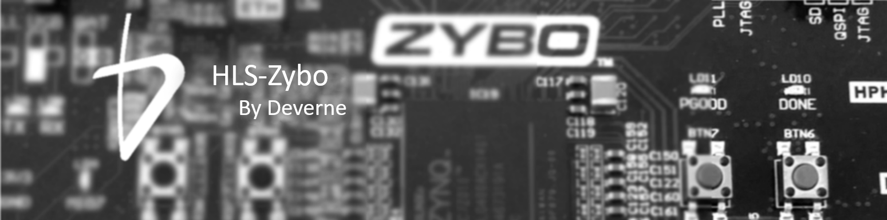
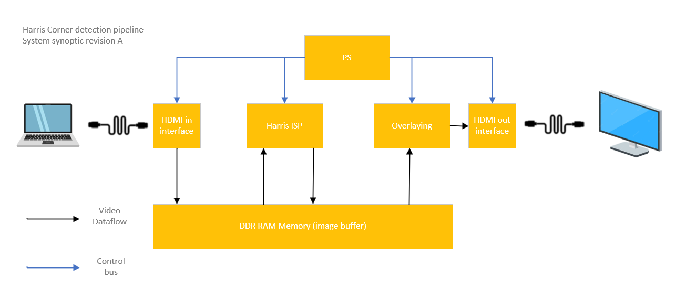

# HLS-Zybo
This repository is a collection of video processing FPGA IPs designed using Vitis HLS. It has been created for educational purpose. Both industrials & academics are more than welcome to give feedbacks on their learning process, or to contribute. 

At the moment, example designs are based on zybo-Z7 board with zynq 7020 FPGA only. 

## Harris corner detection example 

In this example, a real time corner detection is implemented in the Zybo-Z2. The system acquire video from HDMI RX connector, process it using hardware accelerator deisgned with Vitis HLS, and transmit result on HDMI TX connector.

To allow the user to tune the sensitivity of corner detection, a serial menu is provided. Firmware design is also included in this repository. 

System synoptic is provided below

### Video processing IPs
- RGB to Grayscale
- Gaussian convolution filter
- Sobel convolution filter
- Non maximal suppression

### Structural IPs
- DMA reader (memory map to stream)
- DMA writer (stream to memory map)
- Video overlay

### Requirements
- Zybo Z2-20 development board https://digilent.com/reference/programmable-logic/zybo-z7/start
- Vivado webpack edition 2020.2 or later https://www.xilinx.com/support/download/index.html/content/xilinx/en/downloadNav/vivado-design-tools/archive.html
- an SD card FAT32 formatted

### Project structure
- HLS IPs are stored in IP-Lib
- Vivado project can be found under Zybo-Harris-system/gateware
- Vitis project for sofware design can be found under Zybo-Harris-system/software
- A SD card boot image for evaluation can be found under Zybo-Harris-system/quickstart

Feel free to contact this e-mail adress for any questions : laurent.boutigny@deverne-france.com Deverne can provide standard commercial support as well as consulting services

## HLS zero lab

Refer to our wiki to get started with HLS design flow, strating with creating most common image processing IP

